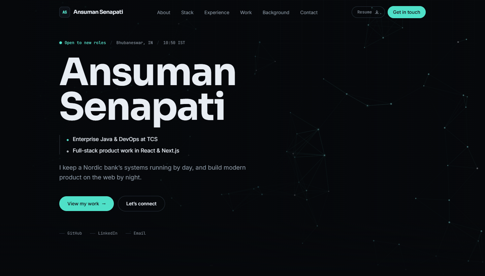

# Portfolio

My personal portfolio site. Single page, dark theme, built with React and Vite.

**Live: [ansumansena.github.io](https://ansumansena.github.io)**



## Stack

| | |
|---|---|
| Framework | React 18 + Vite 6 |
| Language | TypeScript (strict) |
| Styling | Tailwind CSS v4 |
| Animation | Framer Motion 11 |
| Routing | React Router 6 |
| Hosting | GitHub Pages via GitHub Actions |

## Getting started

```bash
npm install
npm run dev
```

Runs at `http://localhost:5173`.

| Script | Does |
|---|---|
| `npm run dev` | Dev server with hot reload |
| `npm run build` | Typecheck, then production build to `dist/` |
| `npm run preview` | Serve the production build locally |
| `npm run lint` | Typecheck only, no emit |
| `npm run build:pages` | Production build plus the GitHub Pages `404.html` and `.nojekyll` |

## Features

- Interactive canvas hero: a node lattice that brightens and links toward the cursor
- Scroll progress indicator and scroll-spy navigation
- Cursor-tracked spotlight and tilt on project cards
- Live local clock showing my time in IST, so visitors know when I am reachable
- One-click resume download from four places on the page
- Email links that copy the address to the clipboard as well as opening a mail client
- Custom 404 page styled as a server log
- Fully responsive, with a dedicated mobile menu

## Project structure

```
src/
├── data/            All page content. Edit here, not in components.
│   ├── profile.ts       Name, tagline, socials, availability
│   ├── experience.ts    Roles
│   ├── projects.ts      Projects, stacks, links
│   ├── skills.ts        Skill groups
│   ├── education.ts     Degree, awards, certifications
│   └── navigation.ts    Nav items and section ids
├── components/
│   ├── Navbar · Hero · About · Skills · Experience
│   ├── Projects · Education · Achievements · Contact · Footer
│   ├── SignalField.tsx  The hero canvas
│   └── ui/              Section, Reveal, Tag, MagneticButton,
│                        ResumeButton, EmailLink
├── hooks/           useScrollSpy, useLocalTime, useCopyToClipboard
└── pages/           Home, NotFound
```

Content is fully separated from presentation. To change any text on the site,
edit a file in `src/data/` and nothing else.

## Accessibility and performance

Lighthouse on the production build:

```
Performance 99 · Accessibility 100 · Best Practices 100 · SEO 100
FCP 0.6s · LCP 1.0s · TBT 0ms · CLS 0
```

- Semantic landmarks, one `h1`, and a skip link as the first tab stop
- Full keyboard navigation with visible focus rings; Escape closes the mobile menu
- Every animation is disabled or reduced under `prefers-reduced-motion`
- The hero canvas pauses via `IntersectionObserver` when scrolled out of view
- Framer Motion and the router are code-split; the 404 page is lazy loaded

## Deployment

Pushing to `main` triggers `.github/workflows/deploy.yml`, which builds and
publishes to GitHub Pages. Pages must be set to **Settings → Pages → Source →
GitHub Actions** once.

The site is a single-page app, so unknown routes need to fall back to
`index.html` for the custom 404 to render. `scripts/ghpages-postbuild.mjs`
handles this by copying `index.html` to `404.html` and writing `.nojekyll`.

Serving from a project repo instead of the user site (`ansumansena.github.io`)
requires setting `REPO_BASE` in `vite.config.ts` to `/<repo-name>/` and
switching the workflow to `npm run build:pages:subpath`. Configs for Netlify
(`public/_redirects`) and Vercel (`vercel.json`) are also included.

## Use

Personal project, published so the code can be read. The written content,
resume, photograph and Open Graph image are mine, please do not reuse those.
No license is granted; if you want to build on the code, just ask.
